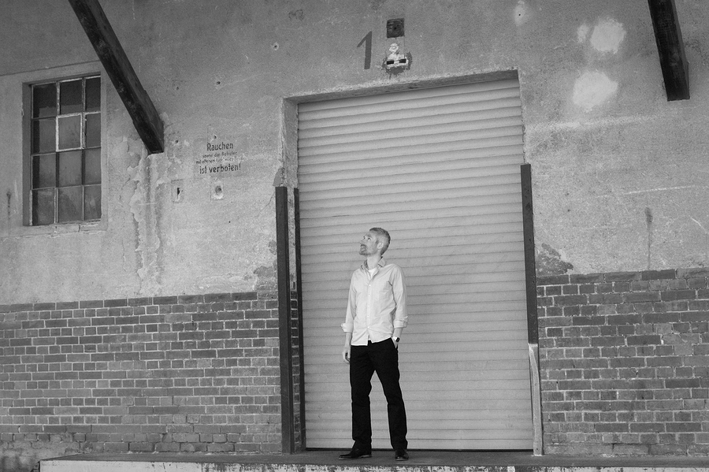

---
output:
  html_document:
    theme: united
    css: css_files/my-style1.css
---
 
 
 
 

[Marc Rexheuser](#CV)  
[Frachtmanagement](#Fracht) [und Datenkompetenz](#Daten) &emsp; <a href="tel:+49.157.54090160">+49.157.54090160</a> &emsp; <a href="mailto:post23@protonmail.com?subject=Hallo">Email</a>

# Fracht

### Old School Materialtransport

Das Speditionsgeschäft kenne ich von der Pieke auf. Schade, daß es so umkämpft und risikoreich ist. Aber ich bin gut darin und es bereitet mir beruflich Freude. Drei Dinge habe ich auf meinem Weg gelernt:

- Frachtmanagement als Kleinstanbieter bedeutet wirklich Verantwortung zu übernehmen. Ich muss nicht nur individuelle Verladerbedürfnisse verstehen. Sondern auch die möglichen Probleme entlang der Prozesskette der beauftragten Logistikpartner. Ich brauche den Blick auf die Schnittstellen *und* ein tiefes Verständnis der realen Abläufe dort. 
- Die Logistik meiner Auftraggeber ist nur dann erfolgreich, wenn Warenempfänger pünktlich, störungsfrei und budgetgerecht beliefert werden. Diesen Erfolg mitzutragen erfordert Momentum. Die Energie dafür gehört zu meinem Kundenservice.
- Transportprozesse sind schnell beurteilt oder kritisiert. Besser ist es, darin auch Verbesserungspotential zu erkennen. Mit meiner Erfahrung helfe ich dieses Potential auch zu *heben* - also Geld zu sparen oder Serviceparameter zu verbessern.

### Low Tech High Touch Dienstleistung

Geringwertige Güter oder hohes Transportaufkommen schreien nach Automatisierung und digitaler Technik. Speditionell ist das nicht meine Welt. Ich punkte bei Versendern hochwertiger Wirtschaftsgüter. Vor allem dann, wenn die digitale Anbindung von Kunden- oder Lieferstrukturen unsinnig teuer und aufwendig wäre, oder einfach nicht gewünscht ist. In dieser analogen Welt mache ich den Unterschied. Beispielsweise durch das Aufzeigen schnellerer Transportkorridore. Oder der ad hoc Organisation von Lager und Konsolidierungsplätzen.

# Daten

### Traditionelles Data Mining
Data Mining ist die Kunst und Wissenschaft der Datenanalyse.^[Graham J. Williams, Director of Data Science bei Microsoft, Entwickler von Rattle] Ich bin dann eher Datenkünstler als Wissenschaftler. So wie ein gutes Bild Bedeutung für den Betrachter schafft, so programmiere ich Datenvisualisierungen, die eingängig sind. Am besten *alle* relevanten Datenpunkte in *einer* Grafik, nicht verteilt über 10 verschiedene Berichte. Da wo es keine bunten Bilder braucht, reicht eine Tabelle. Gern auch interaktiv. Also immer auf der Suche nach der einfachsten aller tragfähigen Lösungen.

Der Kreativität steht die nackenschädigende Arbeit gegenüber. Von der Beschaffung der Rohdaten über die Aufbereitung bis hin zur Erstellung, Validierung und Anpassung von Datenmnodellen. Je grundlegender das so entstandene Modell, um so einfacher können Erkenntnisse kommuniziert werden. Erst durch das wirkliche *Verstehen* der analysierten Daten bekommt das Modell seinen Wert, nicht durch seine Komplexität. Mein gängigstes Handwerkszeug sind also Clustering, Entscheidungsbäume und Assoziationsanalysen.

### Programmiersprache vs. Business Slang

Als Data Miner *übersetze* ich zwischen den kommerziell Verantwortlichen und den Datenbankspezialisten. Der Geschäftsführer definiert das Problem oder die konkrete Fragestellung und der IT-ler weiß wo, wie und welche Rohdaten verfügbar sind. Organisatorisch habe ich also eine Mittlerrolle. Einerseits verstehe ich die operativen Abläufe und die übergeordneten Supply Chain Strategien. Andererseits erkenne ich den Wert der Transaktionsdatengrube. Und dann verbinde ich bestimmte Variablen miteinander, um Datengold zu heben. Beispielsweise in Form von:

- Fehlerquellen sichtbar machen
- Trends erkennen
- Vorhersagen treffen
- Optimale Distributionsstandorte definieren
- komplexe, massenhafte Daten statistisch überschaubar machen
- Sendungsströme geografisch visualisieren
- Scorecards und online Dashboards entwickeln

### Softwareeinsatz kostenneutral

Für alle Analysen nutze ich [R](https://www.r-project.org), beziehungsweise die Entwicklungsumgebung [RStudio](https://www.rstudio.com) Beides Open Source, kostenfrei und zukunftssicher. Einige der größten Namen aus Wissenschaft, Bildung und Industrie sind aktive Unterstützer von RStudio. Für Statistik und Visualisierung nutze ich das [Tidyverse](https://www.tidyverse.org) Package. Reproduzierbare Reports setze ich mit [Rmarkdown](https://rmarkdown.rstudio.com/) auf. [Rattle](https://rattle.togaware.com/), als eigenständige Software mit grafischer Benutzeroberfläche, nehme ich zur Modellierung her.

# CV

### Praxis

**seit 2008** Selbstständig, freier Mitarbeiter

- Konzeption und Abwicklung aller Material- und Maschinentransporte für den Neubau der Deutschen Botschaft in Mauretanien (600 Frachttonnen) im Auftrag einer Arbeitsgemeinschaft
    - Risikoanalyse und Transportversicherung
    - Beschaffung geeigneter Shippers Owned Container
    - Lagerlösung für die Projektlaufzeit
    - Just in Time Containergestellung bundesweit
    - Exportverzollung und Dokumentation
    - Seefracht bis Nouakchott
    - Rückverschiffung und abgabenfreie Wiedereinfuhr von Maschinen und Werkzeugen
    - Einhaltung von geplantem Frachtbudget und Zeitrahmen
- Sprecher und Workshopmoderator auf den 'German Mongolian Logistics Days' zum Thema horizontale Logistikkooperation im Auftrag der Gesellschaft für Internationale Zusammenarbeit GIZ, Ulan Bator
    - Anregung zu Logistikkooperationen zur Effizienzverbesserung 
    - weiterführende Beratungsgespräche in Ministerien und privaten Unternehmen
- Logistikberatung und operative Umsetzung aller Materialbewegungen für ein Ingenieurbüro aus dem Bereich Erneuerbare Energien
    - Transportorganisation für Unternehmensumzug mit Werkzeugen und Maschinen nach Burundi
    - Logistikverantwortung für alle Projekt-Exporte
    - Abverfolgung der bestellten Waren bei Lieferanten europaweit
    - Warenabholung und Lagerung beziehungsweise Konsolidierung für den Weitertransport
    - Neutralisierungsmaßnahmen
    - See- und Luftfracht nach Burundi inklusive Importverzollung und Lieferung bis Baustelle
- Konzeption und Umsetzung einer Kooperation zwischen zwei Spediteuren im Bereich nationale Stückgutdistribution 
    - Fixkostenreduzierung und Serviceverbesserung
    - Begleitung der Anpassung operativer Prozesse   
- Frachtrateneinkauf und Koordination eines Seefracht Cross Trade Projektes (400 Frachttonnen) von Bangladesh nach Zentralafrika, im Auftrag einer Spedition

**2006-2010** 

- Betrieb eines internationalen Handelsgewerbes zur Studienfinanzierung - namhafte Kunden wie Velux, DK oder Dockwise Yacht Transport, US

**2005** Hellmann Worldwide Logistics, Brisbane

- Vertrieb von See- Luft- und Logsitikdienstleistungen

**2003-2004** Hellmann Worldwide Logistics, Hamburg

- Entwicklung eigener Kundenbasis und Key Account Verantwortung bei einem Umsatzvolumen von €7 Mio. p.a.
- Projektmanagement für einen Fabrikumzug (door/door) aus Deutschland in den Iran, ca. 1200 Frachttonnen
- Kalkulation und Koordination für Distributionsprojekte europaweit, inkl. Seefracht aus Fernost bis ca. 300 TEU
- Vertriebliche Begleitung von Lager- und Montagedienstleistungen

**2002** Hellmann Worldwide Logistics, Hamburg

- Sachbearbeitung Operative Seefracht Export Fernost

**2001** Hellmann Worldwide Logistics, Sydney

- Traineeship Operative Luftfracht Export für verderbliche Güter, sowie Operative Seefracht Export für allgemeine Waren

**2000** Bundesmarine

- Grundausbildung als Versorger und Einsatz im Bereich Materialbewirtschaftung
- physische und systemische Ein- und Auslagerung von Ersatzteilen

**1999** TRANSCO Süd GmbH, Konstanz

- Zolldeklarant Import, diverse Zollverfahren und Warengruppen

### Theorie

**2014 - 2015** Zertifikatkurse

- SCM Fundamentals,  Massachusetts Institute of Technology (MIT) via edX
- Supply Chain Design,  Massachusetts Institute of Technology (MIT) via edX
- Foundations of Data Analysis with Rstudio,  University of Texas System via edX

**2006 - 2008** Betriebswirt Internationale Transportlogistik, Studium an der Deutschen Aussenhandels- und Verkehrsakademie, Bremen

- Hauptfächer Logistik und Marketing
- Auszeichnung Beste Abschlussarbeit Sommersemester 2008 für die Entwicklung einer Balanced Scorecard für den Geschäftsbereich Hotellogistik bei Kühne + Nagel

**1996 - 1999** Speditonskaufmann, Berufsausbildung bei TRANSCO Süd GmbH, Konstanz

- Fokus auf (inter)nationalen Ladungs- und Stückgutverkehren auf diversen Verkehrsträgern sowie Zoll
- IHK Stipendium berufliche Bildung
- Auszeichnung als Finalist Bester Auszubildender 1999 Hochrhein Bodensee

### Schwerpunkte

- Internationales Fracht Management 
- Entwicklung von Lösungen für die Transportlogistik
- Ergebnisorientierung, von der Strategie zur konkreten Aktion
- Statistisches Programmieren in R und Datenvisualisierung 

### Sprachen

- Deutsch, Muttersprache 
- Englisch, verhandlungssicher
- Spanisch, Grundkenntnisse
